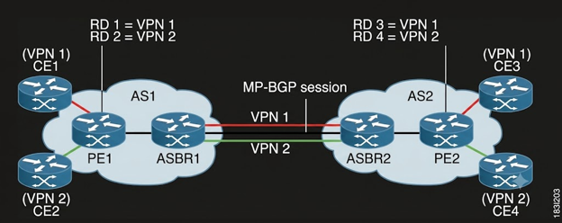
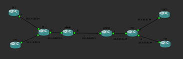

# Inter-AS-MPLS-VPN-Lab



To recreate an Inter-AS-MPLS-VPN Type B network, it must contain two different autonomous systems (AS) and the VPN should span these two systems. Option B allows autonomous system boundary routers (ASBR) to exchange VPN routes using the external boundary gate protocol (eBGP).

### Option B 
1. Uses one MP-BGP session between ASBR1 and ASBR2 to carry all VPN routes.
2. The ASBRs do not have vrf configured on them, they simply act as BGP routers and pass VPN labels.
3. Label swapping happens between ASBR 1 and ASBR2. It changes the next hop address to the current router and assigns a new MPLS label.

### Control Plane (Route Exchange)
1. CE sends its routes to PE1
2. PE1 translates these routes using the route distinguishers (RD) and sends them to ASBR1 using internal BGP (iBGP)
3. ASBR1 sends the routes to ASBR2 using MP-BGP.
4. ASBR2 passes the routes to PE2, which advertises the routes to CE3.

### Data Plane (Packet Forwarding)
1. The packet is encapsulated in a two layer stack
2. The outer label is to get the packet to the next hop or ASBR
3. The inner label identifies the VPN

# Software

GNS3 was used to simulate this lab. The routers were emulated with Dynamips and the images used were for the c7200x series.

# Configuration



Firstly, the topology was configured as shown in the picture. The routing table shows the ip addresses and interfaces for each link. 

OSPF is configured on all routers apart from the link between ASBR1 and ASBR2 because it uses MP-BGP. MPLS is configured inside AS1 and AS2, and the link between ASes (ASBR1 and ASBR2). iBGP is configured inside the AS (PE1-ASBR1) and eBGP is placed between ASBR1 and ASBR2.

### CE1 CUSTOMER EDGE

The loopback address is set because virtual routing and forwarding (VRF) is virtual. Therefore, OSPF will announce the loopback address to ensure that the BGP paths are stable.
```
interface Loopback0
 ip address 11.11.11.11 255.255.255.255
```

The interface to PE1 is configured:
```
interface GigabitEthernet1/0
 description Link to PE1
 ip address 10.1.11.1 255.255.255.0
 negotiation auto
```

BGP configuration:
- A private AS number is assigned.
- The system logs when a neighbour session goes up or down (useful for logging and debugging).
- The network command advertises the loopback address if it exists in the routing table.
-The command neighbour defines the remote peer (Neighbour IP:Remote AS). In this example, the local AS number (65001) is different from the remote AS number (1), which means this is an eBGP session:
```
router bgp 65001
 bgp log-neighbor-changes
 network 11.11.11.11 mask 255.255.255.255
 neighbor 10.1.11.2 remote-as 1
```

On all routers, ip cef is enabled for high speed packet forwarding:
```
ip cef
```

### PE1 PROVIDER EDGE

VRFs are set up to isolate the routing tables for VPN1 and VPN 2:
- The route distinguisher (RD) is a prepended to an IPV4 prefix. It is a unique identifier for the VPN (AS number:ID).
- The route target is an attribute to control the import and export of routes. Exporting a route advertises that route from the PE. Importing a route places that route into the routing table of the VPN (AS:RD).
```
ip vrf VPN1
 rd 1:1
 route-target export 100:1
 route-target import 100:1

ip vrf VPN2
 rd 1:2
 route-target export 100:2
 route-target import 100:2
```

Interface Configuration:
- ASBR facing links (G1/0) uses MPLS instead of standard routing by using command mpls ip.
- CE facing links (G2/0-G3/0) uses command ip vrf forwarding VPNx to strip standard IP routing and place it into an isolated routing sandbox VPNx.
```
interface GigabitEthernet1/0
 description Core Link to ASBR1
 ip address 10.1.13.1 255.255.255.0
 negotiation auto
 mpls ip

interface GigabitEthernet2/0
 description Connects to CE1 (VPN1)
 ip vrf forwarding VPN1
 ip address 10.1.11.2 255.255.255.0

interface GigabitEthernet3/0
 description Connects to CE2 (VPN2)
 ip vrf forwarding VPN2
 ip address 10.1.12.2 255.255.255.0
 negotiation auto
```

OSPF configuration:
- OSPF runs internally within the AS to advertise its loopback address to ABR1 to allow BGP and the Label Distribution Protocol (LDP) to work. 
```
router ospf 1
 network 1.1.1.1 0.0.0.0 area 0
 network 10.1.13.0 0.0.0.255 area 0
```

MULTI-PROTOCOL BGP configuration:
-
```
router bgp 1
 bgp log-neighbor-changes
 neighbor 3.3.3.3 remote-as 1
 neighbor 3.3.3.3 update-source Loopback0
```

```
 address-family vpnv4
  neighbor 3.3.3.3 activate
  neighbor 3.3.3.3 send-community both
 exit-address-family
```

```
 address-family ipv4 vrf VPN1
  neighbor 10.1.11.1 remote-as 65001
  neighbor 10.1.11.1 activate
 exit-address-family
```

```
 address-family ipv4 vrf VPN2
  neighbor 10.1.12.1 remote-as 65002
  neighbor 10.1.12.1 activate
 exit-address-family
```
